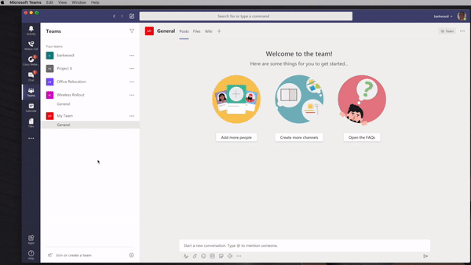
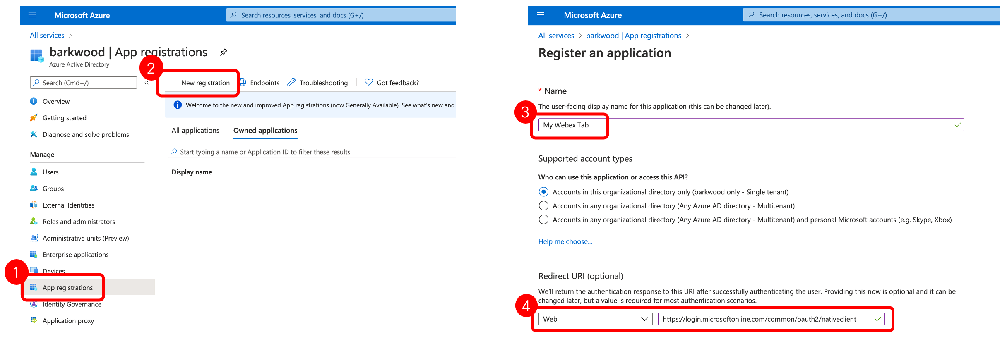
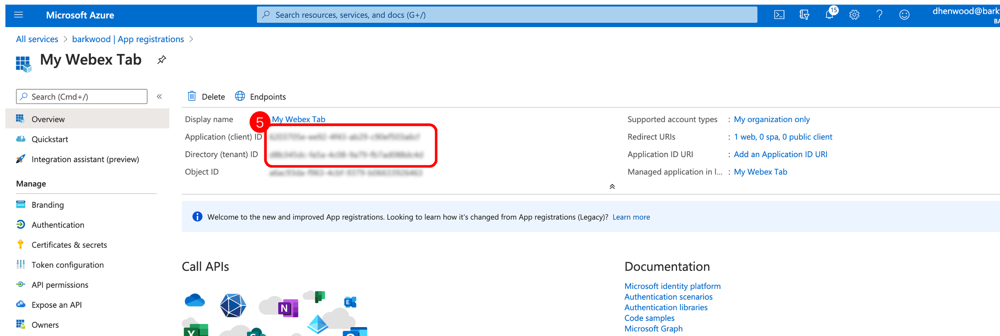
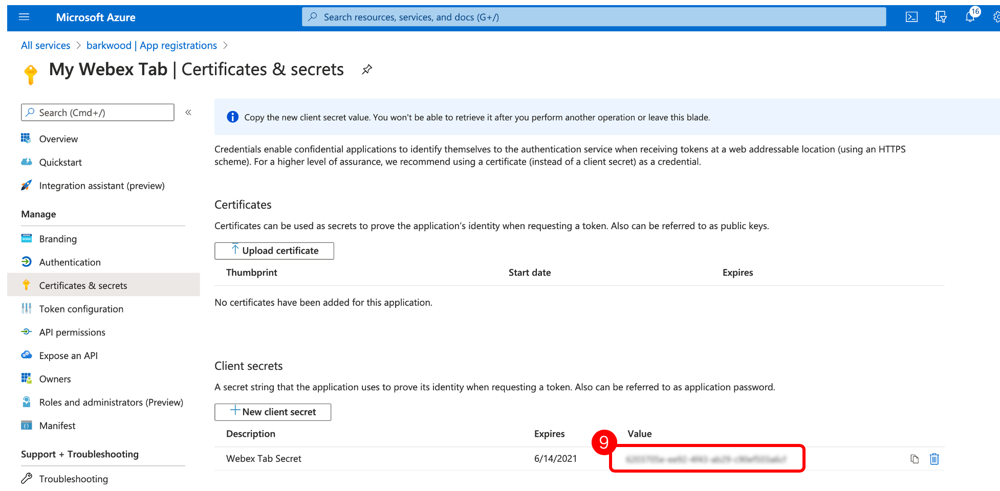

# Automatically add Webex Meetings Tab to MS Teams

This script automates adding a Webex Meetings Tab to all new Microsoft Teams channels that users may create.

A full YouTube video of the code [can be found here](https://www.youtube.com/watch?v=Waone1IG_ag)

* [Setup](#setup)

## Setup

In order to This script requires Microsoft authentication.

1. Select App Registration from the left hand menu
2. Select New Registration
3. Provide a Name for the application
4. Set the Redirect URI to Web and the value to; https://login.microsoftonline.com/common/oauth2/nativeclient

5. Copy both the Applicaiton (client) ID and Directory (tenant) ID

6. Select Certificates and secrets from the left hand menu
7. Select New client secret button
8. Set a name and duration for the secret. Then select Add.

9. This will create the client secret. Copy this value
