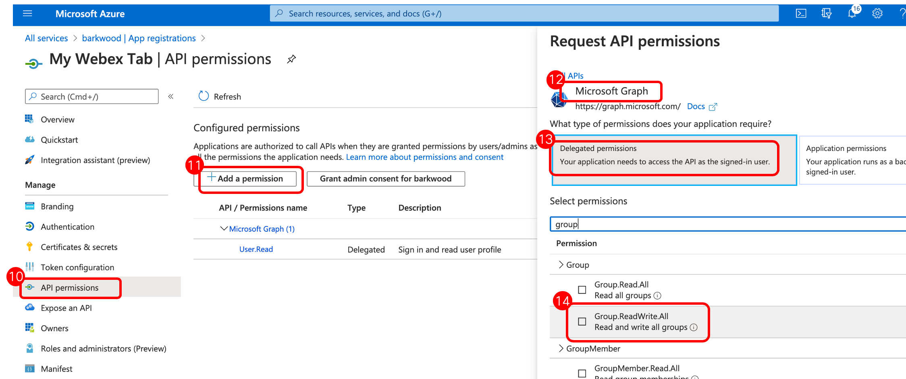

# Automatically add Webex Meetings Tab to MS Teams


This script automatically adds a Cisco Webex Meetings Tab to all new Microsoft Teams channels that users may create.


- [YouTube video](https://www.youtube.com/watch?v=Waone1IG_ag) - demo of Webex Tab being added.
- [Tab Details](https://help.webex.com/ia89ccb/) - Cisco details relating to the integration.


## Content
* [Microsoft Setup](#microsoft-setup)
* [Python Setup](#python-setup)
* [Running script](#running-script)
* [Caveats](#caveats)

## Microsoft Setup

The following setup is required to configure OAuth for the Microsoft Graph API's used.


1. From Azure Active Directory Admin Portal, select 'App Registration' from the left hand menu
2. Select 'New Registration'
3. Provide a Name for the application
4. Set the Redirect URI to Web and enter the value; https://login.microsoftonline.com/common/oauth2/nativeclient


5. Copy both the Applicaiton (client) ID and Directory (tenant) ID


6. Select 'Certificates and secrets' from the left hand menu
7. Select 'New client secret' button
8. Set a name and duration for the secret. Then select Add.


9. This will create the client secret. Copy this value



10. Select 'API Permissions' from the left hand menu
11. Select 'Add a Permission'
12. Select 'Microsoft Graph'
13. Select 'Delegated Permissions'
14. Select 'Group.ReadWrite.all' (may require searching). Save changes. You will also need to 'Grant admin consent'.

## Python Setup

The following needs to be updated within the **config.ini** file.
1. Update **clientid** and **tenantid** from step 5 above
2. Update **clientsecret** from step 9 above
3. Set a **username** and **password** (requires appropriate permissions for Group.ReadWrite.all)
4. The **lastcheck** field can be adjusted if you want the Webex Tab to be added to Teams after a certain date/time (ensure you keep the correct date/time format)
5. _Do not change any fields in the **token** section_

## Running Script
Assuming the above steps were performed, the following command will first get an OAuth token, before performing the Microsoft Graph API's needed to add the Webex Tab to new Microsoft Teams channels. _Note: all testing was done using Python 3.7._

```python addWebexTab.py``` 

## Caveats

The following caveats exist;
1. No automatic running of script when a new Team is created. Currently there does not appear to be a method of being notified of a new Team and as such, it requires the script to run at regular invervals (using tools like cron, etc).
2. Currently the script only adds the Webex Tab to the General channel. Exploring ways to add the tab to all channels that are created (without the potential load of polling all channels across an organisation continually)
