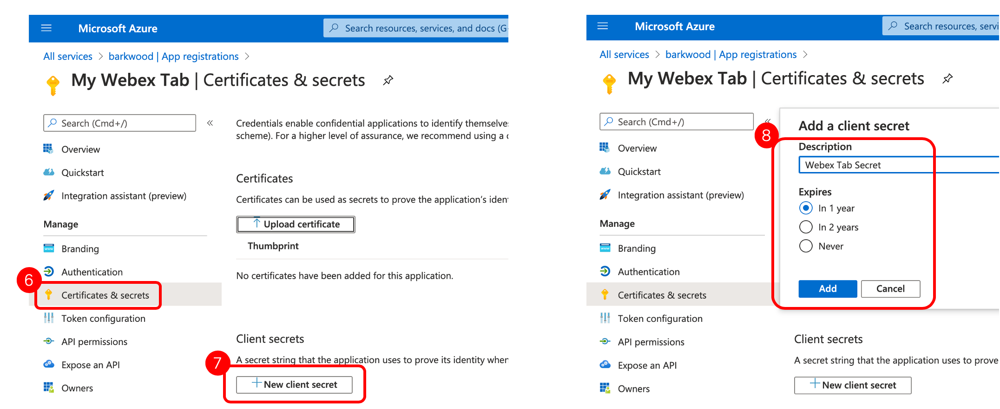

# Automatically add Webex Meetings Tab to MS Teams

This script automates adding a Webex Meetings Tab to all new Microsoft Teams channels that users may create.

A YouTube video of the code running [can be found here](https://www.youtube.com/watch?v=Waone1IG_ag). More details relating to the integration [can be found here](https://help.webex.com/ia89ccb/).

* [Microsoft Setup](#microsoft-setup)
* [Python Setup](#python-setup)
* [Caveats](#caveats)

## Microsoft Setup

The following setup is required to configure OAuth for the Microsoft Graph API's used.

1. Select App Registration from the left hand menu
2. Select New Registration
3. Provide a Name for the application
4. Set the Redirect URI to Web and the value to; https://login.microsoftonline.com/common/oauth2/nativeclient

5. Copy both the Applicaiton (client) ID and Directory (tenant) ID

6. Select Certificates and secrets from the left hand menu
7. Select New client secret button
8. Set a name and duration for the secret. Then select Add.

9. This will create the client secret. Copy this value

10. Select API Permissions from the left hand menu
11. Select Add a Permission
12. Select Microsoft Graph
13. Select Delegated Permissions
14. Select Group.ReadWrite.all (may require searching)

## Python Setup

The following needs to be updated within the **config.ini** file.

1. Update **clientid** and **tenantid** from step 5 above
2. Update **clientsecret** from step 9 above
3. Set a **username** and **password** (requires appropriate permissions for Group.ReadWrite.all)
4. The **lastcheck** field can be adjusted if you want the Webex Tab to be added to Teams after a certain date/time (ensure you keep the correct date/time format)
5. _Do not change any fields in the **token** section_

## Caveats

The following known caveats exist;

1. No automatic running of script when a new Team is created. Requires admin to trigger script at regular invervals (using tools like cron, etc) 
2. Only adding Webex Tab to the General channel.
